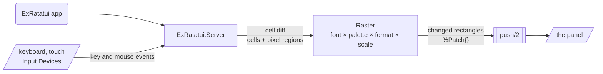

# RasterExRatatui

[](https://hex.pm/packages/raster_ex_ratatui)
[](https://hexdocs.pm/raster_ex_ratatui)
[](https://github.com/mcass19/raster_ex_ratatui/actions/workflows/ci.yml)
[](https://github.com/mcass19/raster_ex_ratatui/blob/main/LICENSE)

Render [ExRatatui](https://github.com/mcass19/ex_ratatui) apps on pixel displays such as e-ink panels, with helpers for Linux framebuffers.

A terminal paints glyphs for us. A panel with nothing but pixels does not, so something has to turn every cell (a symbol, a foreground, a background) into pixels, and blit the bitmaps that `Viewport3D` and `Image` render. `RasterExRatatui` is that something. It sits on top of an `ExRatatui.CellSession`, keeps the cell grid and the pixel regions of the current frame, and hands the device only the rectangles that changed, already packed in the panel's pixel format.

## Flow



A surface (or a `Session` in a process the device already has) runs the app and owns this loop; the panel only ever sees packed pixels, in its own orientation.

## Features

- **A framebuffer is one line** — `use RasterExRatatui.Framebuffer.Surface, app: MyApp`: geometry and format from sysfs, a font scale to match, the console detached, the keyboard found and found again, the app restarted when it quits.
- **Any other panel is one module** — `use RasterExRatatui.Surface`, return the panel geometry from `init/1`, write pixels in `push/2`. The surface process starts the app, folds diffs, rasterises, and forwards input.
- **Rotation** — `rotate: 90` turns the app for a panel mounted on its side; the panel is still written in its own orientation.
- **Patches, not frames** — only changed cells (and changed pixel regions) are rasterised and pushed; `Raster.frame/1` renders a full buffer for panels that want one.
- **Pixel regions** — `Viewport3D` and `Image` arrive as RGB bitmaps and are scaled onto their cell rect at the panel's native resolution.
- **Pixel formats** — `Mono` (1-bit panels: tone rules for cells, Bayer dither for regions), `RGB565`, and `XRGB8888`, with a palette for named, indexed, and RGB colours.
- **Fonts** — a built-in 6×8 bitmap font with box drawing, blocks, and braille, an integer `scale:` for large panels, and a `Font` behaviour to bring another.
- **Keyboards and touch** — `Input.Devices` finds, grabs, and re-finds evdev keyboards and touch panels; `Input.Evdev` and `Input.Touch` turn their events into the key and mouse events a terminal would send, taps landing on the right cell at any rotation.
- **Device helpers** — `Framebuffer` for Linux fbdev: geometry from sysfs, stride-aware writes.
- **Own process** — `Session` runs the app on a raster from a process the consumer already has; `Raster`, `Grid`, fonts, and formats underneath are plain functions.
- **Snapshots** — `Raster.to_png/1` writes what the panel shows as a PNG, for tests and debugging.

## Installation

Add `raster_ex_ratatui` to the dependencies in `mix.exs`:

```elixir
def deps do
  [
    {:raster_ex_ratatui, "~> 0.3"}
  ]
end
```

### Prerequisites

- Elixir 1.17+
- ex_ratatui 0.15 or later (pixel regions: `CellSession.new/3` with `font_size:`; native bitmap rotation for turned panels)

## Quick start

The app needs no change: it is a plain `use ExRatatui.App` that renders widgets exactly as it would in a terminal, so build and try it there first.

**A Linux framebuffer** (a Raspberry Pi with a display, on Nerves) is one module and a child in the supervision tree:

```elixir
defmodule MyDevice.Surface do
  use RasterExRatatui.Framebuffer.Surface, app: MyDevice.App, rotate: 90
end
```

It waits for `/dev/fb0`, reads the panel's size and depth from sysfs, picks the pixel format and a font scale, keeps the kernel console off the display, reads the first USB keyboard (and the touch panel, with `touch: true`) through [`input_event`](https://hex.pm/packages/input_event) in the deps, and restarts the app when it quits. Every default is an option or an override. [Nerves Quick Start](guides/nerves_quickstart.md) goes from `mix nerves.new` to the panel; [Linux Framebuffers](guides/framebuffer.md) has the details.

**Any other panel** (an SPI LCD, an e-ink controller) answers three questions in its own surface: how big it is, how its pixels are packed, and how bytes reach it.

```elixir
defmodule MyDevice.Surface do
  use RasterExRatatui.Surface, app: MyDevice.App, format: RasterExRatatui.PixelFormat.RGB565

  @impl true
  def init(_opts), do: {:ok, [size: {480, 320}], MyDevice.LCD.open!()}

  @impl true
  def push(patches, lcd) do
    Enum.each(patches, &MyDevice.LCD.write(lcd, &1.x, &1.y, &1.width, &1.height, &1.data))
    lcd
  end
end
```

Input is whatever reads the hardware, turned into `ExRatatui.Event` structs and handed to `RasterExRatatui.Surface.send_event/2`. [Building a Surface](guides/surfaces.md) covers whole-frame panels, slow refreshes, crashes, rotation, and testing on the host. A device already driven from its own process starts a `RasterExRatatui.Session` there instead of a surface.

## Examples

The [`examples`](examples/README.md) folder has a headless snapshot script, a benchmark, a Nerves project for a Raspberry Pi display with keyboard and touch, and an e-ink name badge; its README says what each one shows and how to run it.

## Guides

| Guide | Description |
|-------|-------------|
| [Nerves Quick Start](guides/nerves_quickstart.md) | From `mix nerves.new` to an app on a Raspberry Pi's display with keyboard and touch, the build traps, and first checks |
| [Building a Surface](guides/surfaces.md) | The contract: geometry, push, input, crashes, rotation, testing, `Session` for an own process, and a 1-bit e-ink consumer |
| [Fonts](guides/fonts.md) | The glyph layout, the built-in 6×8 font, scale, and bringing a font |
| [Pixel Formats](guides/pixel_formats.md) | `Mono` tone rules and dithering, colour palettes, writing a format |
| [Linux Framebuffers](guides/framebuffer.md) | `Framebuffer.Surface` and what it is made of: device geometry, writes, the kernel console, keyboards, and touch |
| [Telemetry](guides/telemetry.md) | Rasterisation, push, and input events with a `Telemetry.Metrics` example |

## Ecosystem

- [ex_ratatui](https://github.com/mcass19/ex_ratatui) — The core terminal UI library this builds on.
- [phoenix_ex_ratatui](https://github.com/mcass19/phoenix_ex_ratatui) — Run TUIs in the browser within [Phoenix LiveView](https://phoenix-live-view.hexdocs.pm/Phoenix.LiveView.html).
- [kino_ex_ratatui](https://github.com/mcass19/kino_ex_ratatui) — Run TUIs inside [Livebook](https://livebook.dev) notebooks.

## Contributing

See [CONTRIBUTING.md](CONTRIBUTING.md) for development setup and guidelines.

## License

MIT — see [LICENSE](https://github.com/mcass19/raster_ex_ratatui/blob/main/LICENSE).
