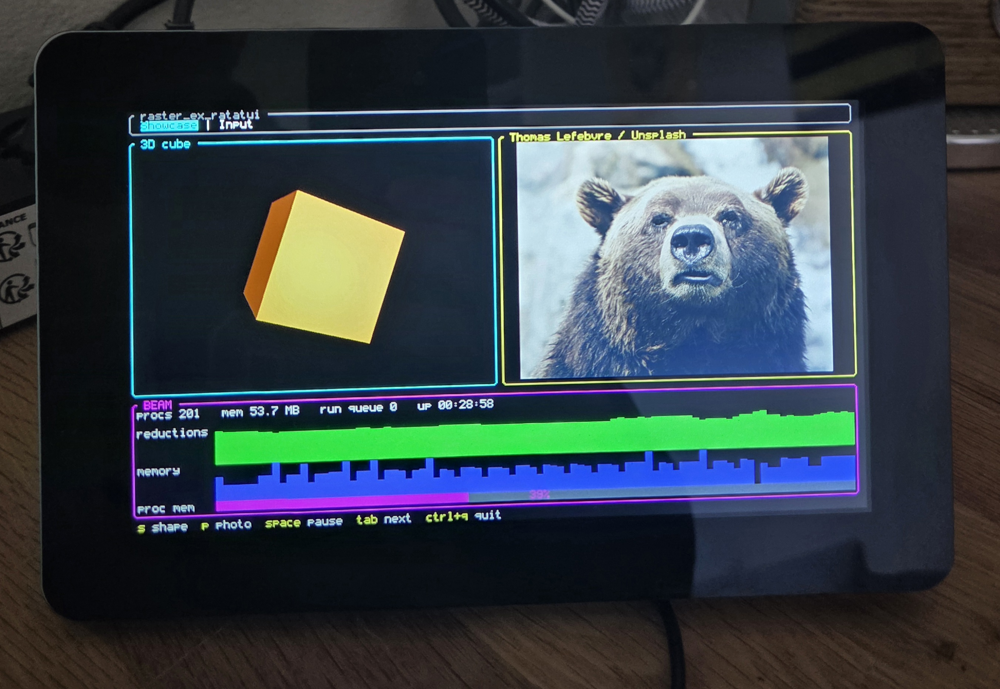

# rpi_framebuffer

A Nerves project that puts an ExRatatui dashboard on a Raspberry Pi's display through `/dev/fb0`, with a USB keyboard. The first hardware is a Raspberry Pi 4 with the official Touch Display 2 (7", DSI, 720×1280), but nothing in the project describes a panel: size and depth are read from sysfs at boot, so an HDMI monitor or another Pi works with the same firmware.



It is the example for the **framebuffer surface**: `RpiFramebuffer.Surface` is one `use RasterExRatatui.Framebuffer.Surface` under a supervisor. For a device that keeps its own screen process, see [`e_ink`](../e_ink).

> **Status:** runs on a Raspberry Pi 4 with the Touch Display 2 (Nerves system 2.0.1, ex_ratatui 0.14.1), in the panel's native portrait. The dashboard comes up about twenty seconds after power, with no console or cursor over it, the keyboard and the touch panel are found at boot, and `ctrl+q` restarts the dashboard. With the Showcase tab turning its object five times a second, a frame costs about 43 ms to rasterise and 13 ms to write, and the surface keeps up. `rotate: 90` in the config turns it for a landscape stand; now that the bitmap rotation happens in the NIF, its pixel regions cost a little over the flat figure instead of about twice it. Tests run on the host against a fake sysfs and a file standing in for `/dev/fb0`.

## What is on the panel

`RpiFramebuffer.Dashboard` is an ordinary `ExRatatui.App` (reducer runtime) with two tabs. It knows nothing about pixels.

| Tab | What to see |
|-----|-------------|
| **Showcase** | What a console cannot show: a lit, turning `Viewport3D` object and a colour photo as pixel regions at the panel's own resolution, next to BEAM sparklines and a gauge made of cells. `s` next object, `p` next photo, `space` pause; on the panel, drag a finger across the object to turn it by hand, and swipe the photo left to right for the next one, right to left for the previous one. |
| **Input** | The keyboard and the touch panel arriving whole: a text input, the last key with its modifiers spelled out, the last touch with the cells the finger passed through, the keys before it, and an echo pane (`enter` sends, `esc` clears). |

A tap on a tab's title switches to it.

## Try it in a terminal first

The dashboard runs in any terminal, no device needed. From this directory:

```sh
mix deps.get
iex -S mix
```

```elixir
iex> RpiFramebuffer.run()
```

In a terminal the 3D object and the photo fall back to what the terminal supports (half blocks, or Kitty/Sixel graphics). Start it from a real terminal: a backgrounded or piped `mix run` has no TTY to draw on.

```sh
mix test
```

runs the whole project on the host, surface included.

## How the surface works

```elixir
defmodule RpiFramebuffer.Surface do
  use RasterExRatatui.Framebuffer.Surface, app: RpiFramebuffer.Dashboard
end
```

The library waits for `/dev/fb0`, reads its size and depth from sysfs, picks the pixel format and a font scale, detaches the kernel console, reads the first USB keyboard through [`input_event`](https://hex.pm/packages/input_event) (and again after an unplug), writes each patch at its offset, and restarts the dashboard when it quits. `config/target.exs` sets `rotate:` for the stand and the rest of the options; the dashboard reads its cell size from the `surface:` option it is mounted with, so the same layout holds on any panel.

